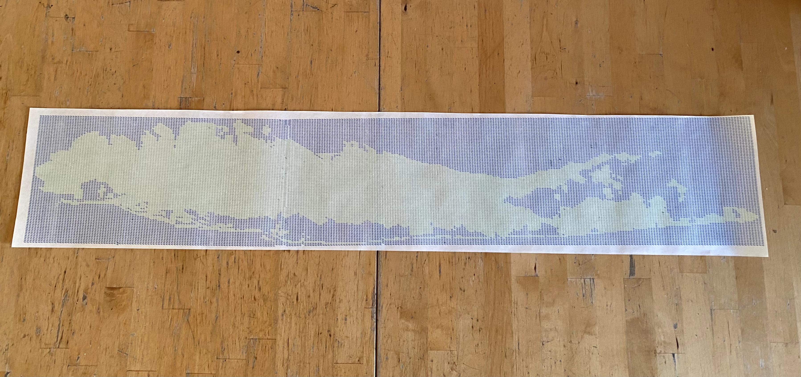
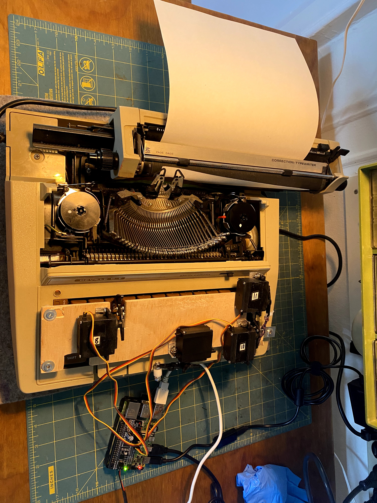

# Typewriter Maps

_Placeholder banner image. Add your long horizontal final map here._

Typewriter Maps is a workflow for turning geographic map grids into physical typewriter drawings using a modified Smith-Corona Deville C/T and a Raspberry Pi-controlled servo rig.

This project started during Day 9 ("analog") of the 30 Day Map Challenge. After making one map manually, it was clear the process worked but was too slow and error-prone for repetition. Manual builds often took 4-5+ hours and required constant focus to count color-specific keystrokes. This repository captures the automated pipeline that now makes repeatable map production practical.

## Quick Workflow (Broad Steps)

1. Create a grid in QGIS using the Python geoprocessing script in `01-Scratch-QGIS/00-PythonScripts-Geoprocessing/`.
2. Convert the grid/map output into machine-readable typing instructions using `03-Create-instructions-html/typewriter_helper_updated_split_export.html`.
3. Move instruction files to the Raspberry Pi and execute them with the controller in `05-TypewriterController/`, using servos connected through an Adafruit Servo Bonnet.

## Repository Structure

- `01-Scratch-QGIS/`: QGIS projects, source geopackage data, and Python script(s) used to generate map-aligned grids.
- `02-Geojson_GRIDS-ONLY/`: exported GeoJSON grid/map outputs used as conversion inputs.
- `03-Create-instructions-html/`: browser-based helper that converts map/grid inputs into typewriter instruction sequences.
- `04-Instructions/`: generated instruction JSONs (and related split/export outputs) ready for execution.
- `05-TypewriterController/`: Raspberry Pi control scripts and config for servo-driven key actuation.
- `00-Misc-Notes_Inspo_FinalMaps/`: personal notes/inspiration/archive material, intentionally excluded from public tracking.

## Detailed Pipeline

### 1) Grid Creation in QGIS

- Work in the QGIS scratch environment under `01-Scratch-QGIS/`.
- Use `01-Scratch-QGIS/00-PythonScripts-Geoprocessing/make_grid_v2-2025-12-07.py` to generate map-specific grids.
- Save intermediate project/state in `.qgz` files and source data in the geopackage as needed.

### 2) GeoJSON Export

- Export or stage grid-only outputs in `02-Geojson_GRIDS-ONLY/` as `.geojson`.
- These files define the geometry and layout used for instruction generation.

### 3) Instruction Generation

- Open `03-Create-instructions-html/typewriter_helper_updated_split_export.html`.
- Convert map/grid data into sequential typewriter instruction files.
- Save generated instruction sets into `04-Instructions/` as `.json` (or split/zipped collections for larger works).

### 4) Raspberry Pi Execution

- Transfer generated instruction files from `04-Instructions/` to the Pi environment.
- Run the controller from `05-TypewriterController/` to execute the sequence on hardware.
- Use the config in `05-TypewriterController/typewriter_config.txt` to tune motion parameters and channel mapping.

## Hardware Context

The current rig uses:

- Typewriter: Smith-Corona Deville C/T
- Controller: Raspberry Pi 4
- Driver board: Adafruit Servo Bonnet
- Power: bench DC power supply
- Stability mod: 680 uF capacitor soldered into bonnet through-holes (significantly reduced actuation mistakes)

Four metal-gear servos currently actuate:

- `3/#` key
- carriage return
- space bar
- color toggle lever

Ribbon usage is primarily blue/green, with occasional black/red. Reliability came from repeated calibration of servo angles and timing.

_Placeholder hardware image. Add a photo of the modified typewriter and servo setup here._

## Configuration

Controller behavior is configured in:

- `05-TypewriterController/typewriter_config.txt`

Use this file to manage key servo mappings, motion limits, and timing values that control print reliability.

## License

If you want others to use this project "as they please," a good default is **CC0-1.0** (public domain dedication) for maximum reuse with minimal restrictions.

If you prefer a software-style license with warranty disclaimer while still being very permissive, use **MIT** instead.

